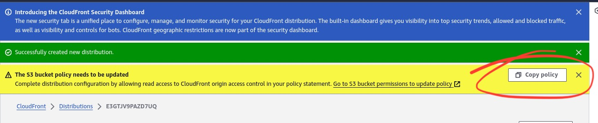

# Hosting a Static Website on AWS using CloudFront

## Overview
This guide provides step-by-step instructions for hosting a static website on Amazon Web Services (AWS) using Amazon CloudFront for content delivery. CloudFront is a content delivery network (CDN) service that accelerates the delivery of your website's content to users around the world while reducing latency.

## Prerequisites
- An AWS account: You need an AWS account to access CloudFront and other AWS services.
- Website files: Ensure that your static website files (HTML, CSS, JavaScript, images, etc.) are ready to be uploaded to an Amazon S3 bucket.

## Steps

1. **Create an S3 Bucket:**
   - Go to the Amazon S3 console.
   - Click "Create bucket".
   - Enter a unique bucket name and choose a region.
   - Click "Create".
   

2. **Upload Website Files to S3 Bucket:**
   - Select the bucket you created.
   - Click "Upload".
   - Upload your website files and folders.
   

3. **Enable Static Website Hosting on S3 Bucket:**
   - In the S3 bucket properties, find the "Static website hosting" section.
   - Click "Edit".
   - Select "Use this bucket to host a website".
   - Enter the name of your index document (e.g., index.html).
   - Optionally, add an error document.
   - Click "Save changes".
   


4. **Configure Bucket Policy for Public Access:**
   - In the bucket's permissions settings, add a bucket policy to allow public access to your website files.

     ```json
     {
         "Version": "2012-10-17",
         "Statement": [
             {
                 "Sid": "PublicReadGetObject",
                 "Effect": "Allow",
                 "Principal": "*",
                 "Action": "s3:GetObject",
                 "Resource": "arn:aws:s3:::stark-construction/*"
             }
         ]
     }
     ```

     Replace `stark-construction` with your bucket name.

   - At this point, the webpage can be viewed using the s3-bucket endpoint
   

5. **Create a CloudFront Distribution:**
   - Go to the Amazon CloudFront console.
   - Click "Create Distribution".
   - Configure the distribution settings:
     - Origin Domain Name: Select the S3 bucket endpoint from the dropdown.

    

     - Origin access: Select "Origin access control settings" and create new OAC

    

     - New OAC settings: leave as default

     

     - Viewer Protocol Policy: you can choose leave as default 
     - Allowed HTTP Methods: you can choose to leave as default
     - Default Root Object: Enter the name of your index document (e.g., index.html). Specify the path if the root document is in a folder
   - Click "Create Distribution".

6. **Update S3 Bucket Policy:**
   - After creating the Cloudfront Distribution, a new bucket policy is generated.

    

   - Click "Copy Policy".
   - Head back to the Permissions Tab on the S3 bucket and edit the bucket policy
   - Overwrite the existing policy and paste the new one

     ```json
     {
        "Version": "2008-10-17",
        "Id": "PolicyForCloudFrontPrivateContent",
        "Statement": [
            {
                "Sid": "AllowCloudFrontServicePrincipal",
                "Effect": "Allow",
                "Principal": {
                    "Service": "cloudfront.amazonaws.com"
                },
                "Action": "s3:GetObject",
                "Resource": "arn:aws:s3:::stark-construction/*",
                "Condition": {
                    "StringEquals": {
                      "AWS:SourceArn": "arn:aws:cloudfront::835515904282:distribution/E3GTJV9PAZD7UQ"
                    }
                }
            }
        ]
    }
     ```

     Replace entire policy (JSON) with generated policy.

     The new policy will contain your bucket name and distribution link where necessary.

7. **Update DNS Records (Optional):**
   - If you want to use a custom domain, update your DNS records to point to the CloudFront distribution domain name.

8. **Test Your Website:**
   - Wait a while for the Cloudfront Distribution to be deployed.
   - Once the CloudFront distribution is deployed, access your website using the CloudFront domain name (or your custom domain if you've configured it.)

   

10. **Clean Up**
    - If you no longer need the S3 bucket, CloudFront distribution, or any associated resources, you can delete them to avoid ongoing charges.
    - Delete the Cloudfront Distribution:
     - Select the Distribution and hit "Disable" to disable the Distribution
     - After it has been disabled the "Delete" option then becomes available and you can go ahead to delete.
    - Delete the S3 Bucket:
     - Select the desired S3 Bucket and "Empty" its contents
     - After it has been emptied the "Delete" option then becomes available and you can go ahead to delete.